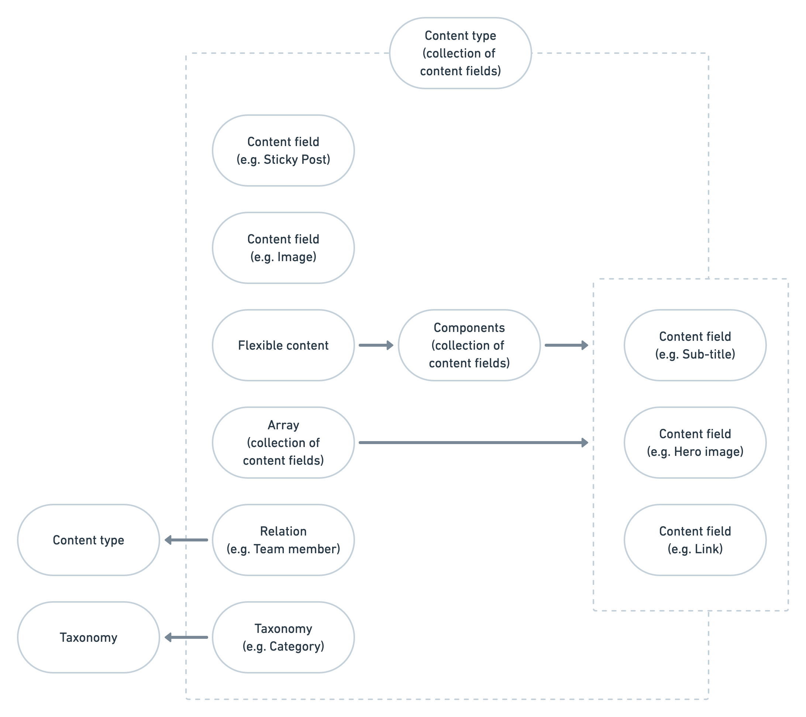

# Content model

* TOC
{:toc}

## How content works

The basic principle of the Frontend project is to read in content from external sources and make it simple to build a 
website out of this.

The common pattern is to read in content from an API (e.g. the WordPress REST API). This raw data 
is converted this into a more useful content object that is passed to the template (Twig).

You can find out how to output content fields on the [Templating content fields](templating/content-fields.md) page.

The following details how the content model works.

## The content model

The content model can be described as so:

* Your website is made up of multiple **content types**
* Each content content type is made up of multiple **content fields**      
    * Content fields can point to another content type via a **relation**
    * Content fields can point to a **taxonomy**  
    * A content field can be **flexible content** which means it contains:
        * Multiple **components**
            * Each component contains multiple **content fields**

### Content types 

Your content is organised into a high-level content type. This represents one piece of content, which usually has its own 
URL (web address). 

For example, in WordPress out of the box you have _posts_ and 
_pages_. You can add custom content fields to help model the different type of content you need on your website. 

A site may have a team page with sub-pages for each team member. To power this you may have a _person_ content type to store 
each team member. You can then use that content to display a page with a list of everyone and also have separate pages for 
further details about each person.

### Content fields

There is a bunch of standard fields for a content type, such as title and URL. However, you normally have custom content 
fields defined for each content type. 

Each content field has a type (e.g. plaintext, image). You can see the list of supported content field types on
[Setting up content types](development/setting-up-content-types.md). 

### Relations

A relation is a special content field which points to another content type. For example, you may have a Case Study content 
type which you link to people to show who worked on a project. This would then link to the People content type via a relation.

### Taxonomies

Taxonomies are used to categorise and tag content. For example, WordPress comes with support for categories and tags. 

Content types can contain a taxonomy value (e.g. a specific category). In this instance the content field points to the 
taxonomy content record.

Another common use case is listing taxonomies separately, for example, if you want to list of categories.

### Array

An array contains multiple fixed content fields. Think about multiple entries, each of which have the same number of fields. 
This is also known as a _repeater_ field in a CMS.

Each entry in the array must contain the same number of content fields.

### Flexible content

Flexible content is similar to an array but allows for different sets of content fields which the user can add in any order. 
We call these sets of content fields _components_. This is also known as a _block_ in a CMS.

Flexible content can contain multiple components, in any order the user chooses. 

The benefit of this approach is that each component has a strict set of content fields which can be used to 
structure content, yet still giving the user the freedom to mix and match components to create interesting page content. 
For example, you may add a full-width image, followed by a text block, followed by a quotation block. 

This gives flexibility of layout, while still providing structured content. 

#### Components

The end result is flexible content is made up of lots of components. Each component has a set of content fields of its own.

